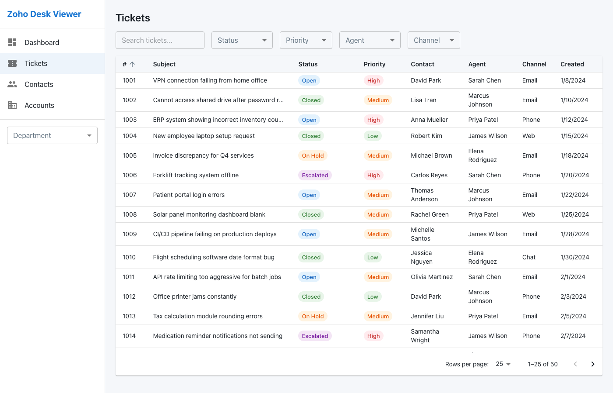
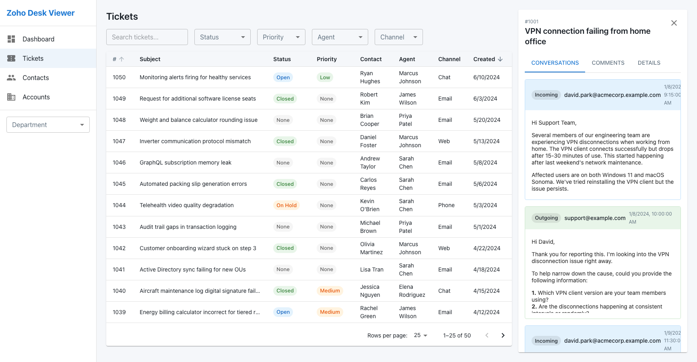

# Zoho Desk Viewer

A local, read-only viewer for Zoho Desk data exported as CSV files. Browse tickets, conversations, contacts, and accounts with an interactive dashboard -- all without sending data to any external service.



## Features

- **Dashboard** -- stat cards, status/priority/channel pie and bar charts, ticket volume over time, agent workload
- **Ticket browser** -- sortable, filterable table with search, status/priority/agent/channel filters, and pagination
- **Conversation threads** -- view email threads with color-coded incoming/outgoing messages and rendered HTML content
- **Comments and time entries** -- internal agent notes and time tracking per ticket
- **Contacts and accounts** -- browse contact and account records with linked ticket views
- **Department filter** -- global department selector scoped across all views



## Getting Started

### Prerequisites

- Node.js 18+
- npm 9+

### Quick Start

```bash
git clone https://github.com/byeager-uptime/zoho-desk-viewer.git
cd zoho-desk-viewer
npm install
```

#### Try with sample data

```bash
CSV_DIR=sample-data npm run seed
npm run dev
```

Open http://localhost:5173 in your browser.

#### Use your own Zoho Desk export

```bash
# Place your Zoho Desk CSV exports in csv-data/
CSV_DIR=csv-data npm run seed
npm run dev
```

### Re-seeding

To re-seed with different data, delete the database first:

```bash
rm -f data/zoho.db
CSV_DIR=sample-data npm run seed
```

## Tech Stack

| Layer | Technology |
|-------|-----------|
| Frontend | React 19, Material UI 7, Recharts, React Router, TanStack Query |
| Backend | Express, better-sqlite3 |
| Build | Vite, TypeScript, tsx |

## Importing Your Own Zoho Desk Data

Export your data from Zoho Desk as CSV files and place them in a directory (default: `csv-data/`, which is gitignored). The expected files are:

| CSV File | Table |
|----------|-------|
| `Departments__1.csv` | departments |
| `Agents__1.csv` | agents |
| `Accounts__1.csv` | accounts |
| `Contacts__1.csv` | contacts |
| `Cases__1.csv` | tickets |
| `Threads__1.csv` | threads |
| `Comments__1.csv` | comments |
| `TimeEntry__1.csv` | timeEntries |

Each CSV must have **Row 0** as display names, **Row 1** as API field names, and **Row 2+** as data rows (standard Zoho Desk export format).

Set the `CSV_DIR` environment variable to point to your export directory:

```bash
CSV_DIR=path/to/your/exports npm run seed
```

## Security and Privacy

- **Read-only** -- the SQLite database is never written to after seeding
- **No credentials stored** -- no Zoho API keys, tokens, or passwords are needed or saved
- **Data stays local** -- all data remains on your machine; nothing is sent to external services
- **XSS protection** -- HTML email content is sanitized with DOMPurify and rendered in sandboxed iframes

## Project Structure

```
├── packages/
│   ├── client/          # React frontend (Vite)
│   │   └── src/
│   │       ├── api/     # API hooks (TanStack Query)
│   │       └── components/
│   │           ├── common/      # DataTable, HtmlContent
│   │           ├── dashboard/   # Charts and stats
│   │           ├── layout/      # AppShell, Sidebar
│   │           ├── tickets/     # List, detail, threads
│   │           ├── contacts/    # Contact views
│   │           └── accounts/    # Account views
│   ├── server/          # Express API server
│   │   └── src/
│   │       ├── db/      # SQLite schema, seed, queries
│   │       └── routes/  # REST endpoints
│   └── shared/          # Shared TypeScript types
├── sample-data/         # Mock CSV data (safe to commit)
├── csv-data/            # Your real Zoho exports (gitignored)
├── data/                # SQLite database (gitignored)
└── docs/                # Screenshots
```

## License

MIT
